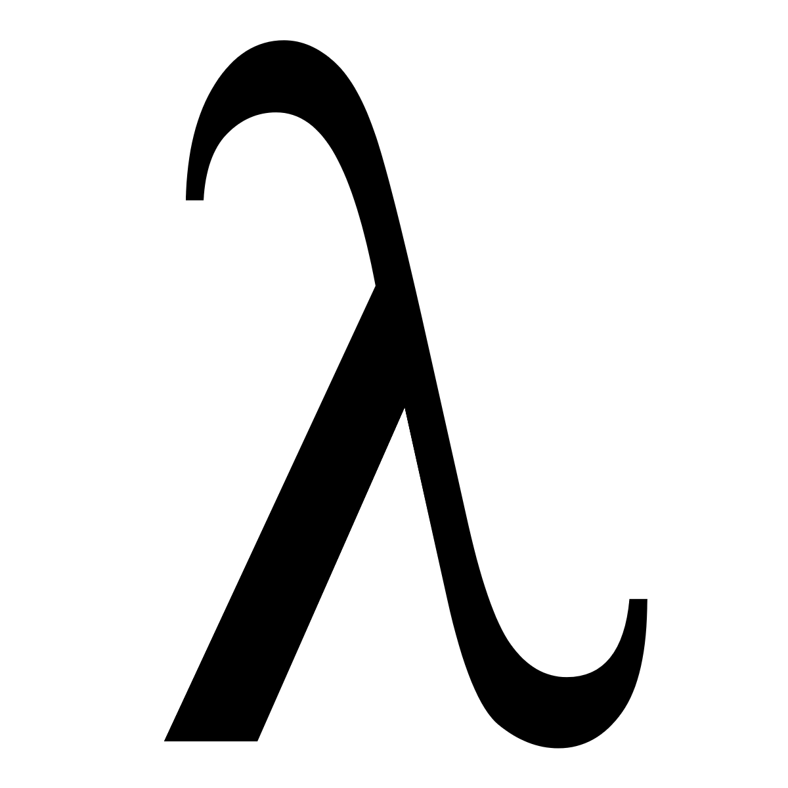

# functional programming 4 noobs

The objective of this repository is above all to learn functional programming and pass on some of this learning to you. I think the best way to learn FP is to start with Scheme, but understanding its cousins, Common Lisp and Haskell, will provide a broader perspective on functional programming paradigms and their practical applications.

### Projects

At the end of each language session, with what we learned we will write a simple interpreter for a pseudo language that we will develop, and all the codes for all interpreters will be in the projects session

### What is Scheme?

Scheme is a minimalist dialect of Lisp (LISt Processing), designed in the 1970s by Guy L. Steele and Gerald Jay Sussman. Its primary goal was to provide a clean, small, and elegant subset of Lisp, emphasizing a functional programming paradigm while retaining Lisp’s core principles like symbolic computation and dynamic typing.

Scheme became popular in academia due to its simplicity and suitability for teaching programming concepts, particularly recursion, higher-order functions, and abstraction. It is a language defined by standards, such as the *Revised^n Report on the Algorithmic Language Scheme (RnRS)* and the *IEEE Scheme Standard*. This ensures consistency across its many implementations.

One of Scheme’s distinguishing features is its minimalistic core. Unlike many programming languages that are bloated with features, Scheme keeps its base small, allowing programmers to build more complex abstractions themselves. This philosophy helps in learning fundamental programming concepts without being overwhelmed by the language's syntax or structure.

Scheme also supports:

- **First-class functions:** Functions are treated as values, meaning they can be passed as arguments, returned from other functions, and stored in data structures.
- **Tail-call optimization:** Efficiently handles recursive calls, making recursion practical for many tasks where iteration might be used in other languages.
- **Macros:** Powerful tools for creating domain-specific languages and transforming code at compile time.
- **Homoiconicity:** Code and data share the same structure, allowing for powerful metaprogramming techniques.

Scheme serves as a foundational language for understanding functional programming concepts and the underlying principles of computation. Its simplicity allows learners to focus on problem-solving, while its expressiveness provides a gateway to mastering more complex languages and paradigms.

### Why learn Scheme, Common Lisp, and Haskell?

These three languages complement each other in unique ways:

1. **Scheme** introduces you to the minimalist philosophy of programming, where simplicity and core abstractions are key. It’s excellent for learning recursion, higher-order functions, and symbolic computation.
2. **Common Lisp** expands on Scheme’s principles but offers a more feature-rich environment. It’s a multi-paradigm language, blending functional, procedural, and object-oriented styles, making it practical for real-world applications.
3. **Haskell** takes functional programming to its extreme, enforcing purity, immutability, and lazy evaluation. It is perfect for understanding the theoretical foundations of FP, like type systems and monads, while also offering tools for writing robust and safe software.

By learning these languages, you’ll gain a solid grasp of different styles of functional programming, preparing you to apply these concepts in various real-world scenarios.

### What is Common Lisp?

Common Lisp is a general-purpose, multi-paradigm programming language that evolved from the original Lisp. It was standardized in the 1980s to unify several divergent Lisp dialects, creating a robust and feature-rich language suitable for both academic and industrial use.

Key characteristics of Common Lisp include:

- **Multi-paradigm support:** Combines functional, procedural, and object-oriented programming.
- **Dynamic and interactive development:** Its REPL (Read-Eval-Print Loop) allows for rapid prototyping and debugging.
- **Rich macro system:** Enables metaprogramming and the creation of domain-specific languages.
- **Extensive standard library:** Provides utilities for file I/O, data structures, string manipulation, and more.
- **Clos (Common Lisp Object System):** A powerful and flexible object-oriented system that supports multiple inheritance and method combinations.

Common Lisp is often praised for its adaptability and expressiveness. It’s used in AI research, symbolic computation, and even modern-day applications like game development. Learning Common Lisp will deepen your understanding of programming paradigms and practical FP tools.

### What is Haskell?

Haskell is a purely functional programming language named after logician Haskell Curry. Designed in the late 1980s, it was created to push the boundaries of functional programming theory while remaining a practical tool for software development.

Key features of Haskell include:

- **Purity:** Functions in Haskell have no side effects, which leads to highly predictable and maintainable code.
- **Lazy evaluation:** Expressions are only evaluated when their results are needed, enabling efficient algorithms and infinite data structures.
- **Strong, static typing:** The type system catches many errors at compile time, ensuring safer and more reliable code.
- **Type inference:** Haskell’s compiler can often infer types, reducing verbosity while maintaining type safety.
- **Monads:** Provides a structured way to handle side effects (e.g., I/O, state changes) in a pure functional setting.

Haskell is widely used in academia and industry for domains where correctness, safety, and mathematical rigor are critical. It is ideal for building robust software like compilers, financial systems, and distributed systems.

Learning Haskell will expose you to advanced FP concepts like category theory, type systems, and functional abstractions, offering a new perspective on how software can be designed.
